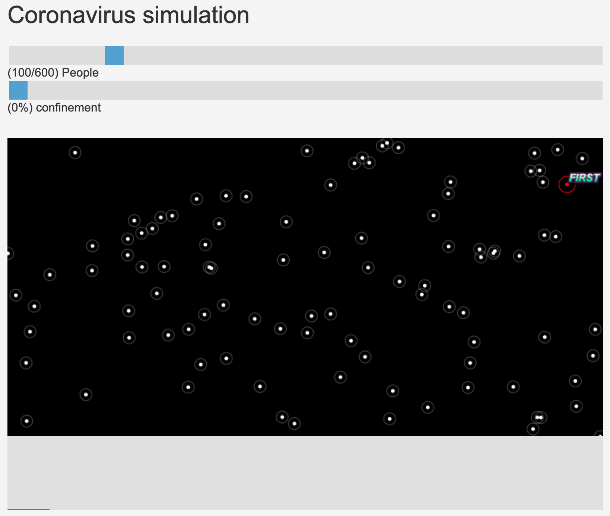
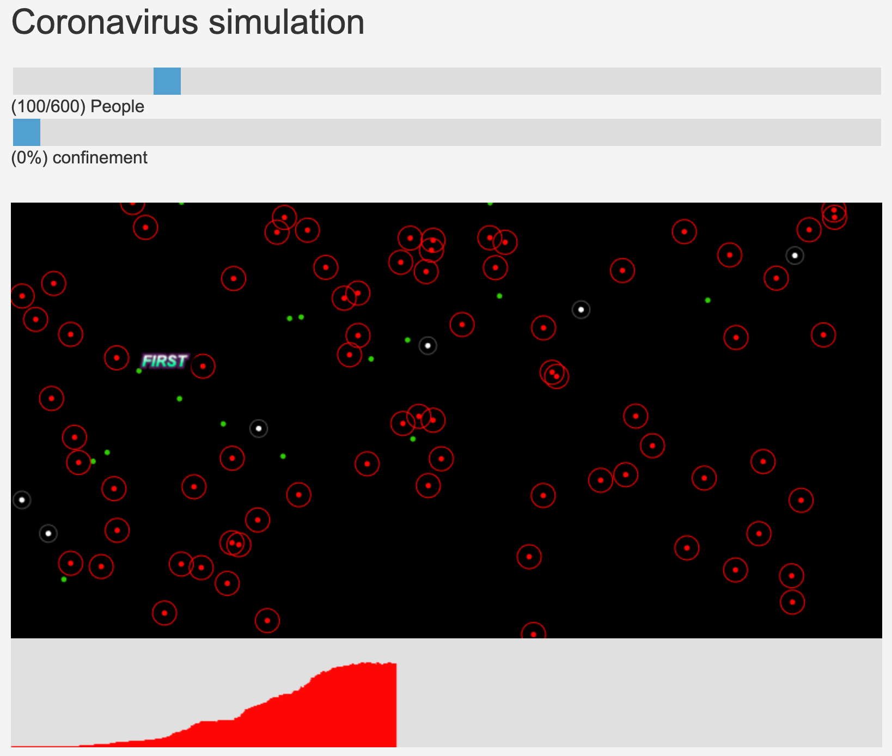
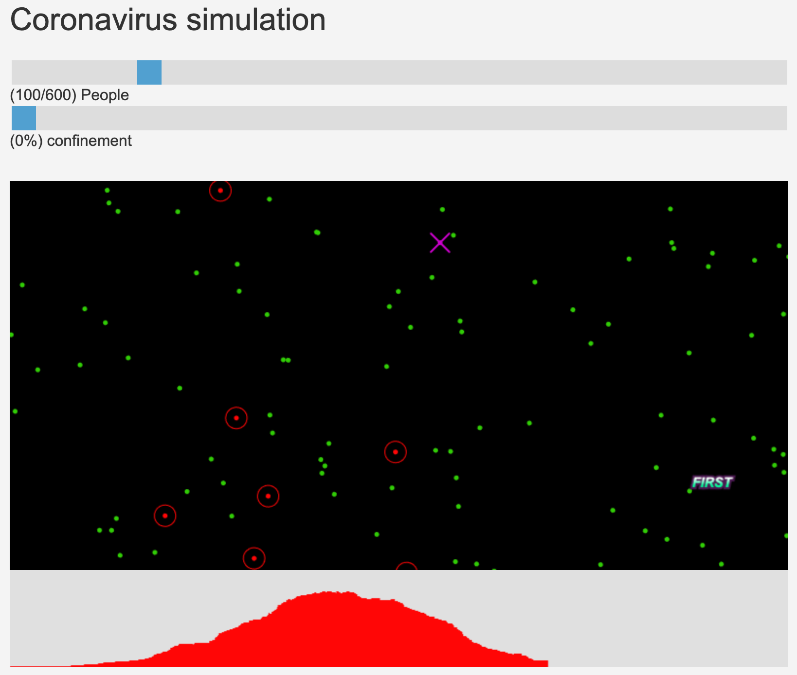
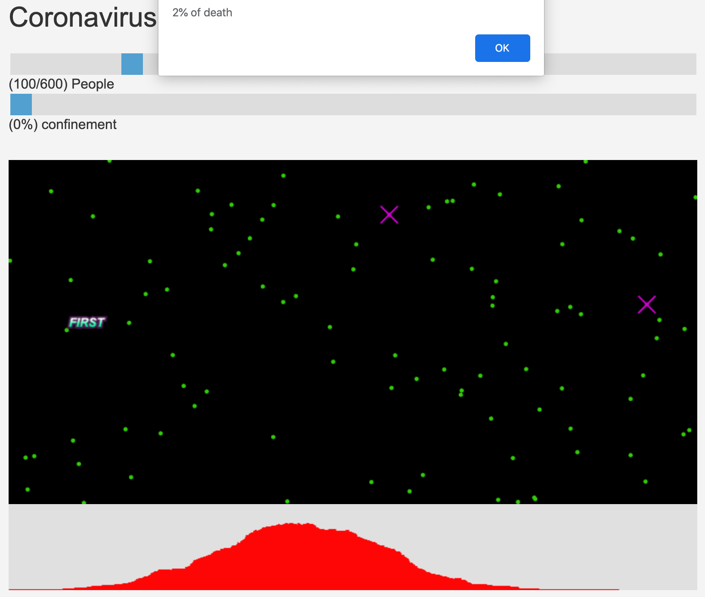

# Covid-19 Simulation

## Introduction

Simulation of coronavirus covid-19

People in :
- `White` are normal
- `Red` are infected with the strain
- `Green` are immune after 1 day of simulation
- `Violet` died after fighting the strain.

The graph below shows the progress of the pandemic in competition with
the advancement of population immunity.

## Overview

## Licence

Copyright (c) Kana00. All rights reserved.

Licensed under the MIT license.
